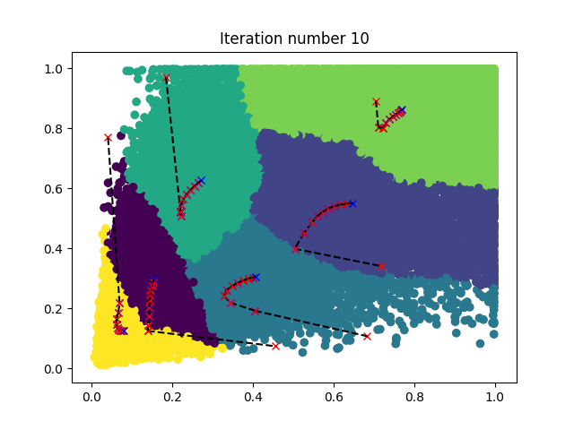
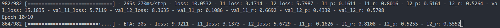

[toc]

# K210 YOLO V3 framework

This is a clear, extensible yolo v3 framework

-   [x] Real-time display recall and precision
-   [x] Easy to use with other datasets
-   [x] Support multiple model backbones and expand more
-   [x] Support n number of output layers and m anchors
-   [x] Support model weight pruning
-   [x] Portable model to kendryte [K210](https://kendryte.com/) chip
# Training on Voc

## Set Environment

`Python 3.7.1`, Others in `requirements.txt`

## Prepare dataset

first use [yolo](https://pjreddie.com/darknet/yolo/) scripts:

```sh
wget https://pjreddie.com/media/files/VOCtrainval_11-May-2012.tar
wget https://pjreddie.com/media/files/VOCtrainval_06-Nov-2007.tar
wget https://pjreddie.com/media/files/VOCtest_06-Nov-2007.tar
tar xf VOCtrainval_11-May-2012.tar
tar xf VOCtrainval_06-Nov-2007.tar
tar xf VOCtest_06-Nov-2007.tar
wget https://pjreddie.com/media/files/voc_label.py
python3 voc_label.py
cat 2007_train.txt 2007_val.txt 2012_*.txt > train.txt
```

now you have `train.txt`, then merge img path and annotation to one npy file:

```sh
python3 make_voc_list.py xxxx/train.txt data/voc_img_ann.npy
```


## Make anchors

Load the annotations generate anchors (`LOW` and `HIGH` depending on the distribution of dataset):
```sh
python3 ./make_anchor_list.py \
    voc \
    --max_iters 10 \
    --is_random True \
    --in_hw 224 320 \
    --out_hw 7 10 14 20 \
    --anchor_num 3 \
    --low .0 .0 \
    --high 1. 1.
```
When success you will see figure like this:


**NOTE:** the kmeans result is random. when you get error , just rerun it.

If you want to use custom dataset, just write script and generate `data/{dataset_name}_img_ann.npy`, Then use `make anchors DATASET=dataset_name`. The more options please see with `python3 ./make_anchor_list.py -h`

If you want to change number of output layer, you should modify `OUTSIZE` in Makefile

## Download pre-trian model

You **must** download the model weights you want to train because I load the pre-train weights by default. And put the files into `K210_Yolo_framework/data` directory. 

**My Demo use `yolo_mobilev1 0.75`**


| `MODEL`       | `DEPTHMUL` | Url                                                                                | Url                                        |
| ------------- | ---------- | ---------------------------------------------------------------------------------- | ------------------------------------------ |
| yolo_mobilev1 | 0.5        | [google drive](https://drive.google.com/open?id=1SmuqIU1uCLRgaePve9HgCj-SvXJB7U-I) | [weiyun](https://share.weiyun.com/59nnvtW) |
| yolo_mobilev1 | 0.75       | [google drive](https://drive.google.com/open?id=1BlH6va_plAEUnWBER6vij_Q_Gp8TFFaP) | [weiyun](https://share.weiyun.com/5FgNE0b) |
| yolo_mobilev1 | 1.0        | [google drive](https://drive.google.com/open?id=1vIuylSVshJ47aJV3gmoYyqxQ5Rz9FAkA) | [weiyun](https://share.weiyun.com/516LqR7) |
| yolo_mobilev2 | 0.5        | [google drive](https://drive.google.com/open?id=1qjpexl4dZLMtd0dX3QtoIHxXtidj993N) | [weiyun](https://share.weiyun.com/5BwaRTu) |
| yolo_mobilev2 | 0.75       | [google drive](https://drive.google.com/open?id=1qSM5iQDicscSg0MYfZfiIEFGkc3Xtlt1) | [weiyun](https://share.weiyun.com/5RRMwob) |
| yolo_mobilev2 | 1.0        | [google drive](https://drive.google.com/open?id=1Qms1BMVtT8DcXvBUFBTgTBtVxQc9r4BQ) | [weiyun](https://share.weiyun.com/5dUelqn) |
| tiny_yolo     |            | [google drive](https://drive.google.com/open?id=1M1ZUAFJ93WzDaHOtaa8MX015HdoE85LM) | [weiyun](https://share.weiyun.com/5413QWx) |
| yolo          |            | [google drive](https://drive.google.com/open?id=17eGV6DCaFQhVoxOuTUiwi7-v22DAwbXf) | [weiyun](https://share.weiyun.com/55g6zHl) |

**NOTE:** The mobilenet is not original, I have **modified it** to fit k210

## Train

Refer to `default.yml` in the `config` directory.

1.  start training, you can modify parameter in `config/default.yml` 
    
    ```sh
    python3 ./keras_train.py --config_file config/default.yml
    ```

    

    **You can use `Ctrl+C` to stop training** , it will auto save weights and model in log dir.


2.  set `config/default.yml` parameter `pre_ckpt` like `log/xxxxx/saved_model_xx.h5` :    

    ```sh
    python3 ./keras_train.py --config_file config/default.yml
    ```
    
3.  set `config/default.yml` parameter `augmenter` is `true`  to enable data augmenter:

    ```sh
    python3 ./keras_train.py --config_file config/default.yml
    ```    
    
4.  Use tensorboard:
    
    ```sh
    tensorboard --logdir log
    ```

**NOTE:** The more options please see `register.py`


## Inference

```sh
python3 ./keras_inference.py log/xxxxx/saved_model_xx.h5 xxxxx.jpg
```

## Freeze

```sh
toco --output_file mobile_yolo.tflite --keras_model_file log/xxxxxx/saved_model_xx.h5
```
Now you have `mobile_yolo.tflite`


## Convert Kmodel

Please refer [nncase](https://github.com/kendryte/nncase)


# Yolo Face Alignment

## Prepare dataset

Download [CelebFaces](http://mmlab.ie.cuhk.edu.hk/projects/CelebA.html) dataset.

I found CelebFaces dataset bbox annotation mislabel, So I corrected it and put the modified file in [weyun](https://share.weiyun.com/5FFNDXr)

Then:
```sh
python3 make_celeba_list.py xxxxx/img_celeba xxxxx/list_bbox_celeba.txt xxxxx/list_landmarks_celeba.txt data/celeba_img_ann.npy
```

## Make anchors

```sh
python3 ./make_anchor_list.py \
    celeba \
    --max_iters 10 \
    --is_random True \
    --in_hw 224 320 \
    --out_hw 7 10 \
    --anchor_num 5 \
    --low .4 .4 \
    --high .5 .5
```

## Train

```sh
python3 ./keras_train.py --config_file config/default_yoloalgin.yml
```


# Face Landmark 98 Points

## Prepare dataset

Download [WFLW](https://wywu.github.io/projects/LAB/WFLW.html) dataset, unzip Then:

```sh
python3 ./make_wflw_list.py xxxxx/WFLW_annotations xxxxx/WFLW_images xxxxx/wflw_images
```

## Train

1.  start train

```sh
python3 ./keras_train.py --config_file config/default_pfld.yml
```

2.  modify `default_landmark.yml` `pre_ckpt` to `log/xxxxx/saved_model_xx.h5`

```sh
python3 ./keras_train.py --config_file config/default_pfld.yml
```

## Convert Kmodel

[nncase](https://ci.appveyor.com/project/sunnycase/nncase/branch/master/job/4dwu9jnsrcfqpq2s/artifacts)
[sdk](https://github.com/kendryte/kendryte-standalone-sdk) develop

```sh
toco --output_file pfld_infer.tflite --keras_model_file log/xxxxxx/infer_model_xx.h5
ncc compile pfld_infer.tflite pfld_opted.kmodel -i tflite -o kmodel -t k210 --dataset ~/xxxxx/images --inference-type uint8 --input-mean 0.5 --input-std 1.0
```

## Inference

1.  Infer one image:


```sh
python3 ./keras_inference.py log/xxxxx/infer_model_xx.h5 xxxxx/xxx.png
```

2.  Infer images:

```sh
python3 ./keras_inference.py log/xxxxx/infer_model_xx.h5 xxxxx/images
```

3.  Plot kmodel results:

```sh
ncc infer xxx.kmodel xxxxx/k210_infer --dataset xxxxx/images --input-mean 0.0 --input-std 0.25
python3 ./keras_inference.py log/xxxxx/infer_model_100.h5 xxxxx/images --results_path xxxxx/k210_infer
```

