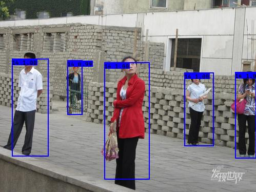

[toc]

# K210 YOLO V3 framework

This is a clear, extensible yolo v3 framework

-   [x] Real-time display recall and precision
-   [x] Easy to use with other datasets
-   [x] Support multiple model backbones and expand more
-   [x] Support n number of output layers and m anchors
-   [x] Support model weight pruning
-   [x] Portable model to kendryte [K210](https://kendryte.com/) chip
# Training on Voc

## Set Environment

See `requirements.txt`

## Prepare dataset

first use [yolo](https://pjreddie.com/darknet/yolo/) scripts:

```sh
wget https://pjreddie.com/media/files/VOCtrainval_11-May-2012.tar
wget https://pjreddie.com/media/files/VOCtrainval_06-Nov-2007.tar
wget https://pjreddie.com/media/files/VOCtest_06-Nov-2007.tar
tar xf VOCtrainval_11-May-2012.tar
tar xf VOCtrainval_06-Nov-2007.tar
tar xf VOCtest_06-Nov-2007.tar
wget https://pjreddie.com/media/files/voc_label.py
python3 voc_label.py
cat 2007_train.txt 2007_val.txt 2012_*.txt > train.txt
```

now you have `train.txt`, then merge img path and annotation to one npy file:

```sh
python3 make_voc_list.py ~/dataset/train.txt data/voc_img_ann.npy
```


## Make anchors

Load the annotations generate anchors:
```sh
make anchors DATASET=voc
```
When success you will see figure like this:


**NOTE:** the kmeans result is random. when you get error , just rerun it.

if you want to use custom dataset, just write script and generate `data/{dataset_name}_img_ann.npy`, Then use `make anchors DATASET=dataset_name`. The more options please see with `python3 ./make_anchor_list.py -h`

## Download pre-trian model

You **must** download the model weights you want to train because I load the pre-train weights by default.

Put the files into `K210_Yolo_framework/data` directory. 

| `MODEL`       | `DEPTHMUL` | Url                                                                                | Url                                        |
| ------------- | ---------- | ---------------------------------------------------------------------------------- | ------------------------------------------ |
| yolo_mobilev1 | 0.5        | [google drive](https://drive.google.com/open?id=1SmuqIU1uCLRgaePve9HgCj-SvXJB7U-I) | [weiyun](https://share.weiyun.com/59nnvtW) |
| yolo_mobilev1 | 0.75       | [google drive](https://drive.google.com/open?id=1BlH6va_plAEUnWBER6vij_Q_Gp8TFFaP) | [weiyun](https://share.weiyun.com/5FgNE0b) |
| yolo_mobilev1 | 1.0        | [google drive](https://drive.google.com/open?id=1vIuylSVshJ47aJV3gmoYyqxQ5Rz9FAkA) | [weiyun](https://share.weiyun.com/516LqR7) |
| yolo_mobilev2 | 0.5        | [google drive](https://drive.google.com/open?id=1qjpexl4dZLMtd0dX3QtoIHxXtidj993N) | [weiyun](https://share.weiyun.com/5BwaRTu) |
| yolo_mobilev2 | 0.75       | [google drive](https://drive.google.com/open?id=1qSM5iQDicscSg0MYfZfiIEFGkc3Xtlt1) | [weiyun](https://share.weiyun.com/5RRMwob) |
| yolo_mobilev2 | 1.0        | [google drive](https://drive.google.com/open?id=1Qms1BMVtT8DcXvBUFBTgTBtVxQc9r4BQ) | [weiyun](https://share.weiyun.com/5dUelqn) |
| tiny_yolo     |            | [google drive](https://drive.google.com/open?id=1M1ZUAFJ93WzDaHOtaa8MX015HdoE85LM) | [weiyun](https://share.weiyun.com/5413QWx) |
| yolo          |            | [google drive](https://drive.google.com/open?id=17eGV6DCaFQhVoxOuTUiwi7-v22DAwbXf) | [weiyun](https://share.weiyun.com/55g6zHl) |

**NOTE:** The mobilenet is not original, I have **modified it** to fit k210

## Train

When you use mobilenet, you need to specify the `DEPTHMUL` parameter. You don't need set `DEPTHMUL` to use `tiny yolo` or `yolo`.

1.  Set `MODEL` and `DEPTHMUL` to start training:

    ```sh
    make train MODEL=xxxx DEPTHMUL=xx MAXEP=10 ILR=0.001 DATASET=voc CLSNUM=20 IAA=False BATCH=16
    ```

    

    **You can use `Ctrl+C` to stop training** , it will auto save weights and model in log dir.

2.  Set `CKPT` to continue training:
    
    ```sh
    make train MODEL=xxxx DEPTHMUL=xx MAXEP=10 ILR=0.0005 DATASET=voc CLSNUM=20 IAA=False BATCH=16 CKPT=log/xxxxxxxxx/yolo_model.h5
    ```

3.  Set `IAA` to enable data augment:
    
    ```sh
    make train MODEL=xxxx DEPTHMUL=xx MAXEP=10 ILR=0.0001 DATASET=voc CLSNUM=20 IAA=True BATCH=16 CKPT=log/xxxxxxxxx/yolo_model.h5
    ```

4.  Use tensorboard:
    
    ```sh
    tensorboard --logdir log
    ```

**NOTE:** The more options please see with `python3 ./keras_train.py -h`


## Inference

```sh
make inference MODEL=xxxx DEPTHMUL=xx CKPT=log/xxxxxx/yolo_model.h5 IMG=data/people.jpg
```

You can try with my model :

```sh
make inference MODEL=yolo_mobilev1 DEPTHMUL=0.75 CKPT=asset/yolo_model.h5 IMG=data/people.jpg
```



**NOTE:** The more options please see with `python3 ./keras_inference.py -h`


## Prune Model
    
```sh
make train MODEL=xxxx MAXEP=1 ILR=0.0003 DATASET=voc CLSNUM=20 BATCH=16 PRUNE=True CKPT=log/xxxxxx/yolo_model.h5 END_EPOCH=1
```

When training finish, will save model as `log/xxxxxx/yolo_prune_model.h5`.


## Freeze

```sh
toco --output_file mobile_yolo.tflite --keras_model_file log/xxxxxx/yolo_model.h5
```
Now you have `mobile_yolo.tflite`


## Convert Kmodel

Please refer [nncase](https://github.com/kendryte/nncase)

## Caution

1.  Default parameter in `Makefile`
2.  `OBJWEIGHT`,`NOOBJWEIGHT`,`WHWEIGHT` used to balance precision and recall
3.  Default output two layers,if you want more output layers can modify `OUTSIZE`
4.  This implementation of **wh_loss** is different from the original yolov3, which I think can accelerate the convergence of the model
5.  If you want to use the **full yolo**, you need to modify the `IMGSIZE` and `OUTSIZE` in the Makefile to the original yolo parameters

